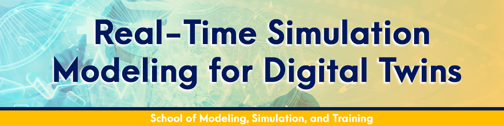

# Real-Time Simulation Modeling for Digital Twins

Welcome to the online textbook for the graduate course on Real-Time Simulation Modeling for Digital Twins.

---

!!! abstract "Welcome"
    Welcome to the online textbook for the graduate-level course, "Real-Time Simulation Modeling for Digital Twins." This book is designed to be your primary resource as we journey from the foundational concepts of twinning to the advanced skills required to build, deploy, and analyze simulation-powered Digital Twins in a variety of domains.

## Our Mission

The term "Digital Twin" has moved beyond industry buzzword to become a cornerstone of digital transformation in engineering, manufacturing, logistics, and beyond. However, a Digital Twin is not a product you can buy; it is a system you must build. At its heart, a true Digital Twin is powered by a **living, synchronized simulation model**.

This course is built for the **modeler**, the **simulationist**, and the **systems thinker**. Our mission is to equip you with the deep, methodological knowledge required to construct the "brain" of the Digital Twin. We will move beyond the superficial visualization layer to master the core simulation paradigms—Discrete-Event Simulation, Agent-Based Modeling, System Dynamics, and Physics-Based Modeling—and learn how to wield them to create predictive, insightful, and valuable digital counterparts of real-world systems.

---

## How to Use This Book

This online textbook is built on the [Material for MkDocs](https://squidfunk.github.io/mkdocs-material/) framework, which provides several useful features to enhance your learning:

*   **Persistent Navigation:** The left-hand navigation bar allows you to quickly jump between chapters and sections. It will always show you where you are in the book's structure.
*   **Integrated Search:** The search bar at the top is incredibly fast and powerful. You can search for any term or concept across the entire textbook, and it will provide instant results.
*   **Interactive Code Blocks:** All code snippets have a "copy" button in the top-right corner, allowing you to easily transfer code to your own development environment.
*   **Light/Dark Mode:** Use the sun/moon icon in the header to toggle between light and dark themes for your reading comfort.

This book is designed to be a living document. We will follow its structure closely in our lectures, and the hands-on lab exercises are directly tied to the concepts introduced in each chapter.

---

## Textbook Structure: A Roadmap

This book is organized into five distinct parts, each building upon the last to take you from foundational theory to advanced, real-world deployment.

### **Part I: Foundations of Digital Twins and Simulation**
We begin by establishing the "why" and "what." We will define the Digital Twin paradigm, differentiate it from its predecessors, and establish simulation as its indispensable analytical engine. We'll conclude with a high-level survey of the core modeling methodologies that we will master.

### **Part II: Core Simulation Modeling Techniques**
This is the methodological heart of the course. We will take a deep dive into the four workhorse paradigms of simulation, with each chapter dedicated to a single approach:

*   **Chapter 4:** Discrete-Event Simulation (DES) for twinning processes.
*   **Chapter 5:** Agent-Based Modeling (ABM) for twinning complex adaptive systems.
*   **Chapter 6:** System Dynamics (SD) for twinning strategic feedback systems.
*   **Chapter 7:** Dynamical Systems for twinning high-fidelity physical components.

### **Part III: Enabling Real-Time "Twining" and Synthesis**
With a solid modeling foundation, we then tackle the engineering challenges of making our models *live*. We will cover the data ingestion protocols, state synchronization techniques, and the powerful methods for creating hybrid, multi-paradigm models to capture real-world complexity.

### **Part IV: Validation, Analysis, and Advanced Applications**
A live model is not enough; it must be a trustworthy model that we can use to make decisions. Here, we explore the advanced topics of continuous validation, uncertainty quantification, predictive "what-if" analysis, and using the twin as a testbed for optimization and AI-driven control.

### **Part V: Deployment and Future Directions**
In the final part, we zoom out to consider the practicalities of deployment. We'll cover the software architectures, cloud platforms, and containerization technologies needed to run a Digital Twin in a production environment. We will conclude by looking to the horizon, discussing the future of the field and the critical ethical responsibilities that come with this powerful technology.

---

Let's begin.